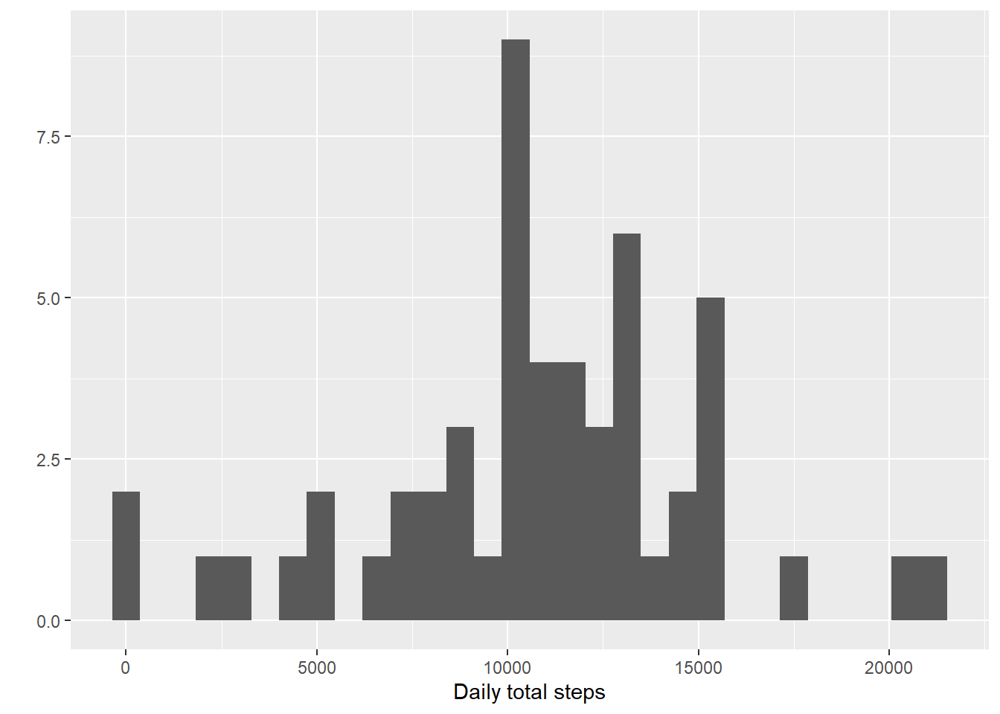

This is to remove the messages all over the document.

```r
knitr::opts_chunk$set(message = F)
```


## Loading and preprocessing the data

```r
library(readr)
activities <- read_csv("activity.zip", col_types = cols())

library(dplyr, quietly = TRUE)
mutated <- mutate(activities, clean_steps = ifelse(is.na(steps), 0, steps))
mutated
```

```
## # A tibble: 17,568 x 4
##    steps date       interval clean_steps
##    <dbl> <date>        <dbl>       <dbl>
##  1    NA 2012-10-01        0           0
##  2    NA 2012-10-01        5           0
##  3    NA 2012-10-01       10           0
##  4    NA 2012-10-01       15           0
##  5    NA 2012-10-01       20           0
##  6    NA 2012-10-01       25           0
##  7    NA 2012-10-01       30           0
##  8    NA 2012-10-01       35           0
##  9    NA 2012-10-01       40           0
## 10    NA 2012-10-01       45           0
## # ... with 17,558 more rows
```


## What is mean total number of steps taken per day?

```r
grouped <- group_by(mutated, date)
summarized <- summarise(grouped, date, total_steps = max(clean_steps))

library(ggplot2)
qplot(summarized$total_steps, geom="histogram", xlab="Daily total steps.") 
```



```r
daily_total_mean <- mean(summarized$total_steps)
daily_total_median <- median(summarized$total_steps)
```
The mean of the total number of steps taken per day is 522.0819672 and the median is 542

## What is the average daily activity pattern?


## Imputing missing values


## Are there differences in activity patterns between weekdays and weekends?
