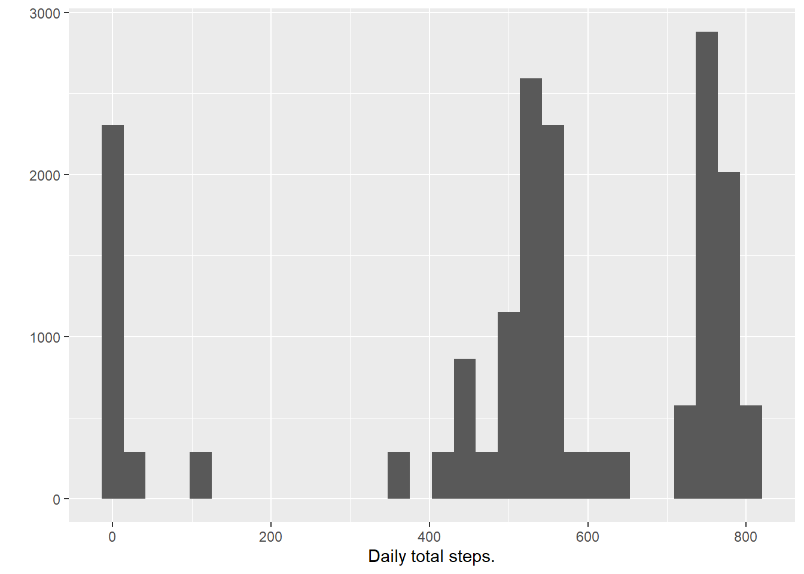
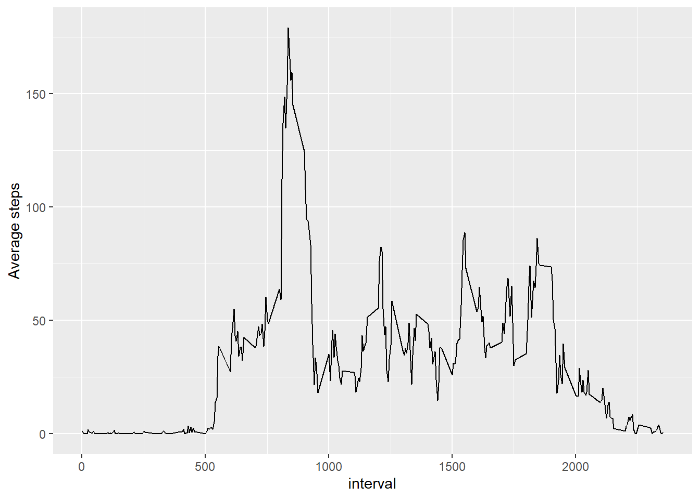
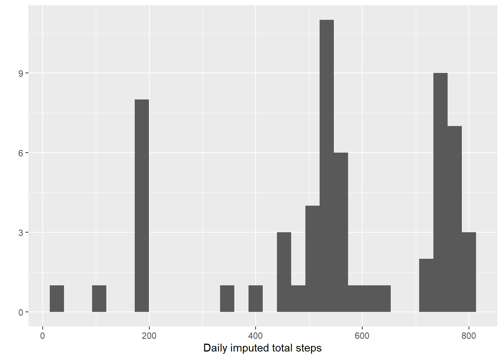
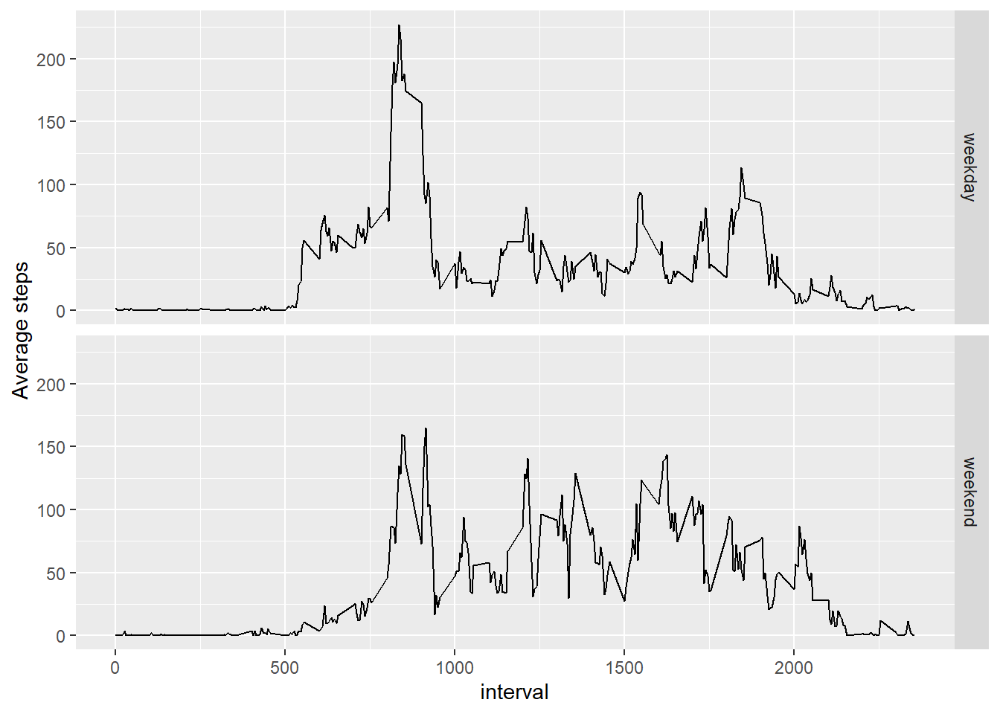

This is to remove the messages all over the document.

```r
knitr::opts_chunk$set(message = F, warning = F)
```


## Loading and preprocessing the data

```r
library(readr)
activities <- read_csv("activity.zip", col_types = cols())
```


## What is mean total number of steps taken per day?

```r
library(dplyr, quietly = TRUE)
filtered <- filter(activities, !is.na(steps))
grouped_dates <- group_by(filtered, date)
summarized_daily_steps <- summarise(grouped_dates, total_steps = sum(steps))

library(ggplot2)
qplot(summarized_daily_steps$total_steps, geom="histogram", xlab="Daily total steps")
```



```r
daily_total_mean <- mean(summarized_daily_steps$total_steps)
daily_total_median <- median(summarized_daily_steps$total_steps)
```
The mean of the total number of steps taken per day is 1.0766189\times 10^{4} and the median is 1.0765\times 10^{4}

## What is the average daily activity pattern?


```r
grouped_intervals <- group_by(filtered, interval)
summarized_interval_average <- summarise(grouped_intervals, average_steps = mean(steps))

qplot(interval, average_steps, data = summarized_interval_average, geom="path", ylab="Average steps") 
```



```r
max_average_steps <- max(summarized_interval_average$average_steps)
filtered_max_steps <- filter(summarized_interval_average, average_steps == max_average_steps)
max_average_interval <- unique(filtered_max_steps$interval)
```
The 5-minute interval, on average across all the days in the data set, contains the maximum number of steps is 835

## Imputing missing values


```r
missing_values <- filter(activities, is.na(steps)) 
total_missing_values <- count(missing_values)
```
The total number of missing values in the data set is 2304

```r
imputed <- left_join(missing_values, summarized_interval_average, by = "interval")
imputed_join_columns <- select(imputed, date, interval, average_steps)
imputed_activities <-
  left_join(activities, imputed_join_columns, by = c("date", "interval"))
imputed_unified <- mutate(imputed_activities, imputed_steps = ifelse(is.na(steps), average_steps, steps))

grouped_imputed_dates <- group_by(imputed_unified, date)
summarized_imputed_steps <- summarise(grouped_imputed_dates, total_steps = sum(imputed_steps))

qplot(summarized_imputed_steps$total_steps, geom="histogram", xlab="Daily imputed total steps")
```



```r
imputed_total_mean <- mean(summarized_imputed_steps$total_steps)
imputed_total_median <- median(summarized_imputed_steps$total_steps)
```
The mean of the total number of steps taken per day after imputation is 1.0766189\times 10^{4} and before imputation was 1.0766189\times 10^{4} and the median is 1.0766189\times 10^{4} and before imputation was 1.0765\times 10^{4}, which indicates almost no change in the reported measures, where mean didn't change at all but median slightly increased, more interestingly, the median after imputation is exactly the same as the mean, so, one can say that imputing the missing values didn't impact the original estimates of the total daily number of steps.

## Are there differences in activity patterns between weekdays and weekends?


```r
library(chron)
day_type_unified <- mutate(imputed_unified, day_type = factor( ifelse(is.weekend(date), "weekend", "weekday")))

unified_grouped_intervals <- group_by(day_type_unified, day_type, interval)
summarized_unified_average <- summarise(unified_grouped_intervals, average_steps = mean(imputed_steps))

qplot(interval, average_steps, data = summarized_unified_average, geom="path", ylab="Average steps", facets = "day_type")
```


