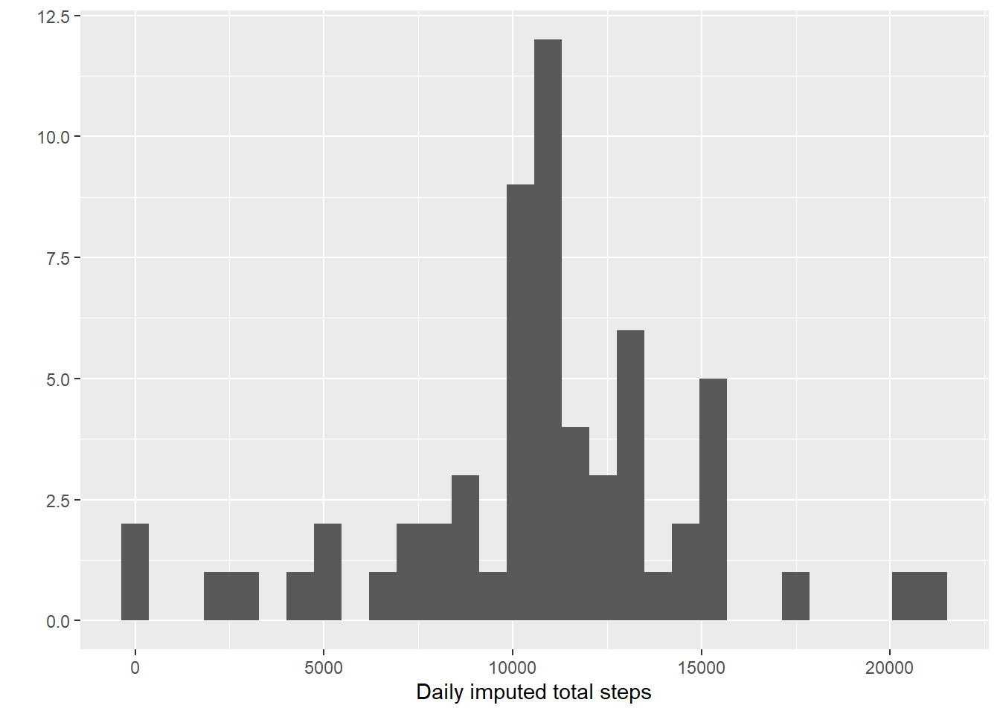

This is to remove the messages all over the document.

```r
knitr::opts_chunk$set(message = F)
```


## Loading and preprocessing the data

```r
library(readr)
activities <- read_csv("activity.zip", col_types = cols())

library(dplyr, quietly = TRUE)
mutated <- mutate(activities, clean_steps = ifelse(is.na(steps), 0, steps))
mutated
```

```
## # A tibble: 17,568 x 4
##    steps date       interval clean_steps
##    <dbl> <date>        <dbl>       <dbl>
##  1    NA 2012-10-01        0           0
##  2    NA 2012-10-01        5           0
##  3    NA 2012-10-01       10           0
##  4    NA 2012-10-01       15           0
##  5    NA 2012-10-01       20           0
##  6    NA 2012-10-01       25           0
##  7    NA 2012-10-01       30           0
##  8    NA 2012-10-01       35           0
##  9    NA 2012-10-01       40           0
## 10    NA 2012-10-01       45           0
## # ... with 17,558 more rows
```


## What is mean total number of steps taken per day?

```r
grouped_dates <- group_by(mutated, date)
summarized_daily_steps <- summarise(grouped_dates, total_steps = max(clean_steps))

library(ggplot2)
qplot(summarized_daily_steps$total_steps, geom="histogram", xlab="Daily total steps") 
```


```r
daily_total_mean <- mean(summarized_daily_steps$total_steps)
daily_total_median <- median(summarized_daily_steps$total_steps)
```
The mean of the total number of steps taken per day is 522.0819672 and the median is 542

## What is the average daily activity pattern?


```r
grouped_intervals <- group_by(mutated, interval)
summarized_interval_average <- summarise(grouped_intervals, average_steps = mean(clean_steps))

qplot(interval, average_steps, data = summarized_interval_average, geom="path", ylab="Average steps") 
```


```r
max_average_steps <- max(summarized_interval_average$average_steps)
filtered_max_steps <- filter(summarized_interval_average, average_steps == max_average_steps)
max_average_interval <- unique(filtered_max_steps$interval)
```
The 5-minute interval, on average across all the days in the data set, contains the maximum number of steps is 835

## Imputing missing values


```r
missing_values <- filter(mutated, is.na(steps)) 
total_missing_values <- count(missing_values)
```
The total number of missing values in the data set is 2304

```r
imputed <- left_join(missing_values, summarized_interval_average, by = "interval")
imputed_join_columns <- select(imputed, date, interval, average_steps)
mutated_imputed <- 
  left_join(mutated, imputed_join_columns, by = c("date", "interval"))
mutated_imputed_unified <- mutate(mutated_imputed, imputed_steps = ifelse(is.na(steps), average_steps, steps))

grouped_imputed_dates <- group_by(mutated_imputed_unified, date)
summarized_imputed_steps <- summarise(grouped_imputed_dates, total_steps = max(imputed_steps))

library(ggplot2)
qplot(summarized_imputed_steps$total_steps, geom="histogram", xlab="Daily imputed total steps") 
```



```r
imputed_total_mean <- mean(summarized_imputed_steps$total_steps)
imputed_total_median <- median(summarized_imputed_steps$total_steps)
```
The mean of the total number of steps taken per day after imputation is 545.5745767 and before imputation was 522.0819672 and the median is 542 and before imputation was 542, which indicates almost no change in the reported measures, where mean is slightly increased but median didn't change at all, so, one can say that imputing the missing values didn't impact the original estimates of the todal daily number of steps.

## Are there differences in activity patterns between weekdays and weekends?
